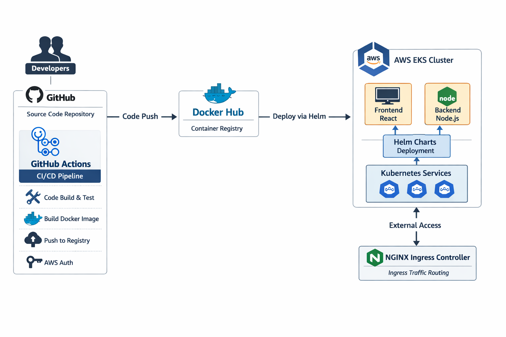
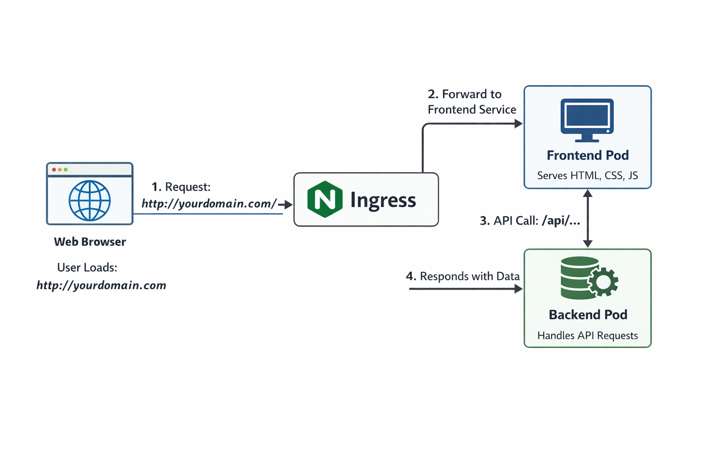

CI/CD Pipeline Implementation on AWS EKS

Using GitHub Actions, Docker, Helm, and Ingress

1. Introduction

This project demonstrates the implementation of a fully automated CI/CD pipeline for deploying a containerized microservices application to Amazon Elastic Kubernetes Service (EKS).

The system automates the entire workflow from code commit to production deployment, ensuring consistency, reliability, and scalability.

2. Project Objective

The objective of this project was to:

Automate build and deployment processes

Containerize application components

Deploy workloads to AWS EKS

Expose the application externally using Ingress

Implement scalable and repeatable Kubernetes deployments

3. System Architecture

The architecture consists of:

GitHub repository for source code management

GitHub Actions for CI/CD automation

Docker for containerization

Docker Hub as container registry

AWS EKS for Kubernetes orchestration

Helm for application deployment

NGINX Ingress Controller for external access

4. Implementation Overview

Continuous Integration (CI)

When code is pushed to the main branch, GitHub Actions automatically:

Installs dependencies

Executes tests

Builds Docker images

Pushes images to Docker Hub

This ensures that only validated builds are deployed.

Continuous Deployment (CD)

After successful image push:

The pipeline authenticates with AWS

Helm upgrades or installs the application on EKS

Kubernetes performs rolling updates

Ingress routes traffic to the frontend service

5. Kubernetes Deployment

The application consists of:

Backend service (Node.js)

Frontend service (React)

Kubernetes Deployments for pod management

Services for internal networking

Ingress for external routing

6. Key Features

Fully automated CI/CD workflow

Containerized microservices architecture

Helm-based deployment strategy

External access via Ingress

Scalable Kubernetes infrastructure

Rolling update deployment model

7. Conclusion

This project successfully implements an industry-style CI/CD pipeline using modern DevOps tools and AWS cloud infrastructure. The solution ensures automated, scalable, and reliable application deployment on Kubernetes.